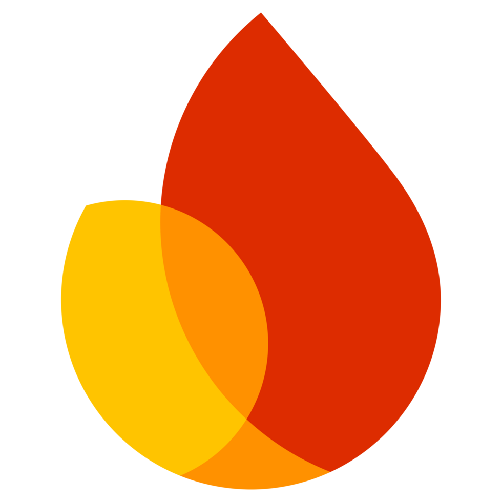

<h1 align="center">Good Day Sire! My name is Sam Mariscal</h1>
<h3 align="center">An Information Technology Student and Aspiring Software Developer</h3>

I'm an IT student with experience in  Java, C, JavaScript, Python, basic PHP,basic C# and learning Kotlin. 
I've worked with frameworks like Django, Express, Laravel, React.js, and JavaFX, Asp.net 
along with frontend tools like Tailwind CSS and Bootstrap. 

I’m familiar with PostgreSQL and MySQL, with basic knowledge in MongoDB and Firebase. 
I'm continuously learning and hoping improve my software development skills.

<h3 align="left">Contact Me:</h3>

---

<h3 align="left">Skills & Tools:</h3>

<h4>Programming Languages</h4>

<h4>Frontend / UI</h4>

<h4>Backend</h4>

<h4>Frameworks / Libraries</h4>

<h4>Databases</h4>

  

<h4>Hardware / Embedded</h4>

<h4>Game Engines</h4>

Secret
<!-- Unity hidden intentionally -->

---

<h3 align="left">Projects Built:</h3>
<table>
<tr>
<th>Project Name</th>
<th>Description</th>
<th>Built With</th>
</tr>

<tr>
<td>Paolitos</td>
<td>A restaurant reservation system with table management and booking features.</td>
<td>Java, JavaFX, MySQL</td>
</tr>

<tr>
<td>Abellana Playbook</td>
<td>A sports booking system for reserving courts and facilities.</td>
<td>Java, JavaFX, MySQL</td>
</tr>

<tr>
<td>Threadly</td>
<td>A clothing marketplace for buying and selling second-hand clothes.</td>
<td>PHP, Tailwind CSS, MySQL</td>
</tr>

<tr>
<td>Eden Sylvan</td>
<td>An adventure game exploring a mystical world still not finished though.</td>
<td>Confidential</td>
</tr>

<tr>
<td>The Knight Named Sam</td>
<td>A pixel-style platformer game with combat and obstacles.</td>
<td>Confidential</td>
</tr>

</table>

---

<h3 align="left"> Currently Learning & Exploring:</h3>

I am exploring AI, DevOps, cloud services, and advanced backend development 
while continuously improving my problem-solving and coding skills.

---

  

  <h3>Overview</h3>

  

 <em> If i stop now, how will i ever become what i want to be?</em>
  

---

<h3> Support Me:</h3>

