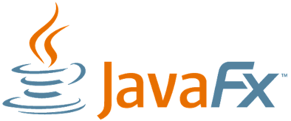
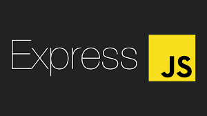

<h1 align="center">Good Day Sire! My name is Sam Mariscal</h1>
<h3 align="center">An Information Technology student and aspiring Full Stack Developer(Beginner)</h3>

I’m an IT student with experience in PHP, Java, C, JavaScript, Python, and beginner-level C# . I’ve worked with frameworks like Django,Express, Laravel, ASP.NET, React.js, and JavaFX, and frontend tools like Tailwind CSS and Bootstrap. I’m familiar with PostgreSQL and MySQL databases,beginner-level MongoDB and I’m continuously learning, building projects, and improving my software development skills.

---

<h3 align="left"> Contact Me:</h3>

---

<h3 align="left">Skills & Tools:</h3>

<h4>Programming Languages</h4>

<h4>Frontend / UI</h4>

<h4>Backend</h4>

<h4>Frameworks / Libraries</h4>

<h4>Databases</h4>

<h4>Hardware / Embedded</h4>

<h4>Game Engines</h4>

  Secret
<!---->

---
<h3 align="left"> Projects Built:</h3>
<table>
<tr>
<th>Project Name</th>
<th>Description</th>
<th>Built With</th>
</tr>
<tr>
<td>Paolitos </td>
<td>A restaurant reservation system where customers can view dishes and book tables. It includes table management, menu display, and booking features.</td>
<td>Java, JavaFX, MySQL</td>
</tr>
<tr>
<td>Abellana Playbook</td>
<td>A gym and sports booking system for Abellana Sports in Cebu, allowing users to reserve courts depending on the sport they want to play, such as basketball, swimming, etc.</td>
<td>Java, JavaFX GUI, MySQL</td>
</tr>
<tr>
<td>Threadly</td>
<td>A clothing marketplace platform for buying and selling thrift and second-hand clothes, promoting sustainable fashion and affordable style.</td>
<td>PHP, Tailwind CSS, MySQL</td>
</tr>
<tr>
<td>Eden Sylvan</td>
<td>An adventure game where you explore a mysterious world (Still not finished).</td>
<td>C#</td>
</tr>
<tr>
<td>The Knight Named Sam</td>
<td>A Mario-like pixel game where you play as a knight navigating obstacles and defeating enemies, built using *secret**.</td>
<td>**secret*#</td>
</tr>
</table>

<h3 align="left">🌱 Currently Learning & Exploring:</h3>

I want to try building small projects and exploring new frameworks to improve my skills. I want to expand my knowledge such as learning  AI, DevOps, cloud services, and advanced backend technologies, while becoming a more confident and capable developer.

---

<h3 align="left">☕ Support Me:</h3>

